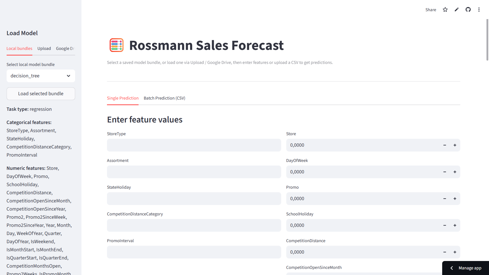

# Rossmann Sales Forecast

## Streamlit app

https://rossmann-sales-ml.streamlit.app/ (Random Forest model is too big for GitHub, so, need to be uploaded via google drive: https://drive.google.com/file/d/1fQWk0hGJuFuz1cUaA8pYX8c7hSteUTWs/view?usp=sharing)

## Manual run

Before start, download:
- data file **rossman_prepared.csv** https://drive.google.com/file/d/1l5ofh6iX6yWtnltgS7nGdH_qks_6O0wA/view?usp=drive_link and put it into **data** folder
- random forests saved model https://drive.google.com/file/d/1fQWk0hGJuFuz1cUaA8pYX8c7hSteUTWs/view?usp=sharing and unzip it into **models/random_forest** folder (or generate new using **MLproject.ipynb**)

This repository contains:
- **Streamlit-app** for inference of saved models
- **Jupiter Notebook** for data preparation and training



---

## Requirements

- Python 3.9+
- Libraries: `streamlit`, `pandas`, `numpy`, `scikit-learn`, `joblib`

Install dependencies:
```bash
pip install -r requirements.txt
```

> **Data/models:** saved model bundles are expected to be in **`./models`** (each folder contains `model.joblib`, `preprocessor.joblib`, `meta.json`).

---

## Preparing models (notebook / scripts)

1. Run Jupiter Notebook to:
- prepare data (preprocessor, cat_features, num_features),
- train models (LinearRegression, DecisionTree, RandomForest, Logistic),
- save them using `joblib` in `./models/<bundle_name>/` directory.
2. For each model, the following will be stored:
- `model.joblib`
- `preprocessor.joblib`
- `meta.json` (contains `cat_features`, `num_features`, `task_type`)

Example structure:
```
./models/
├─ linear_regression/
│ ├─ model.joblib
│ ├─ preprocessor.joblib
│ └─ meta.json
├─ decision_tree/
│ ├─ model.joblib
│ ├─ preprocessor.joblib
│ └─ meta.json
├─ random_forest/
│ ├─ model.joblib
│ ├─ preprocessor.joblib
│ └─ meta.json
├─ logistic_regression/
├─ model.joblib
├─ preprocessor.joblib
└─ meta.json
```

---

## Running the Streamlit application

Run command:
```bash
streamlit run app_streamlit.py
```

**Features:**
- Select a saved model (scans `./models`)
- **Single Prediction**: manually enter feature values
- **Batch Prediction**: load CSV with `cat_features + num_features` columns
- For classification, shows class, for regression — sales forecast

---

## Verification

1. After launching the application, select a model from the drop-down list.
2. Enter feature values ​​or load CSV.
3. Click **Get Prediction**.
4. Save the results via the **Download** button.

---

## Notes

- One-Hot Encoder is configured with `handle_unknown="ignore"`, so new categories are processed correctly.
- It is important that the **order and column names** in the CSV match what the model expects (see `meta.json`).